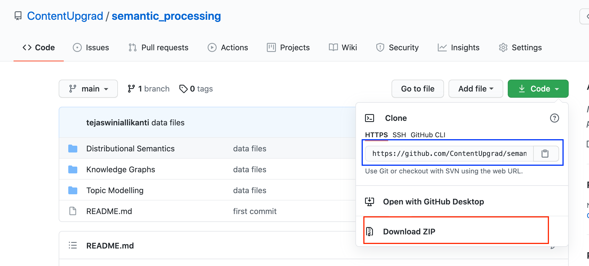

# Welcome to Semantic Processing Module

## TOC:
- What is where?
- FAQs

### What is where?
The folder structure is given below:

As you can see there are three main folders when you log in:

1. **Distributional Semantics** This is where all the code files regarding distributional semantics sessions are kept

2. **Knowledge Graphs** This is where all the code files regarding Knowledge Graph session are kept
3. **Topic Modelling**This is where all the code files regarding Topic Modelling session are kept

The datasets required are linked in the code files itself. Please follow the steps that are shown in platform to install the data files

 ### Common gotchas to avoid

 1. **Always shut down the notebooks when you are done with your work**

2. **Don't run two notebooks (if using tensorflow) simultaneously**
   
Tensorflow has the tendency to use all the gpu memory. If you are running one notebook in which you are training a tensorflow model, trying to run another notebook and training a tensorflow model will give you an error.

